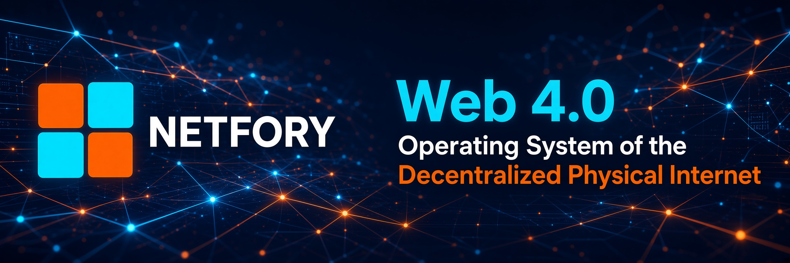
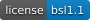

# 🌐 Netfory: The Web 4.0 Infrastructure

**Netfory is the Web 4.0 operating system of the Decentralized Physical Internet (DePIN). Netfory replaces centralized cloud hosting (AWS, Vercel, Cloudflare) with a sovereign Peer-to-Peer network powered by user-owned hardware.**

## 🚀 Key Features

- **Zero-Infrastructure Architecture:** Apps deploy directly to the P2P network via `dev://` and `sn://` protocols. No servers to seize, no domains to revoke.
- **Infrastructure Protection:** Unlike legacy P2P networks, Netfory nodes don't expose direct IPs to the public internet. The network protects seeders from DDoS attacks, ensuring 24/7 uptime.
- **Proof-of-Utility Economics:** Native coin STH rewards participants for providing real storage and bandwidth. Block emission is halted; value is driven by utility.
- **Reputation Over Censorship:** A cryptographically verified two-tier catalog (`Official | All`) ensures safety without centralized bans. Direct links always work.
- **High-Performance Transport:** Built on **Iroh (QUIC)** for NAT traversal and **BLAKE3** for instant content verification.
- **E2EE Communication:** Integrated messenger and mail client with X25519 encryption and economic anti-spam.

## 🛠 Tech Stack

| Component | Technology | Purpose |
| :--- | :--- | :--- |
| **Core Client** | Tauri v2 (Rust) + Vue 3 | Desktop OS, Wallet, dApp Runner |
| **Transport** | Iroh (QUIC) | P2P connectivity, Hole Punching |
| **Storage** | BLAKE3 + Merkle Trees | Content-addressable, verifiable blobs |
| **Discovery** | Mainline DHT + mDNS | Trackerless peer discovery |
| **Blockchain** | SmartHoldem DPoS | Identity, Naming, Economic Anchor |
| **Encryption** | X25519 + AES-256-GCM | E2EE for mail and messaging |

## 📦 Ecosystem Repositories

- **netfory-client:** The main desktop application (Wallet, Store, Seeder).
- **[smartnet-relay](https://github.com/NETFORY/smartnet-relay):** A lightweight, self-hosted relay server for the NETFORY P2P network.
- **[smartnet-sdk](https://github.com/NETFORY/smartnet-sdk):** TypeScript SDK for building dApps on Netfory.
- **[netfory-provider](https://github.com/NETFORY/netfory-provider):** API Bridge & Router (SmartNet / Web 4.0).

## 💰 Tokenomics & Economics

Netfory uses the **STH** coin as fuel and anti-spam shield.
- **Deflationary by Design:** Block emission is halted. Fees for names, dApps, and messages are burned or locked.
- **Proof-of-Utility:** Seeders earn STH based on uptime (`K_up`), data volume, and active apps.
- **Anti-Spam:** Economic barriers make mass spamming financially irrational.

## 🤝 How to Contribute

1. Read the [Netfory 101](https://smartholdem.io/white-paper) White Paper.
2. Check out the [DevHub](https://smartholdem.io/devhub) for API references.
3. Join our [Telegram Community](https://t.me/smartholdem) for technical discussions.

## 📜 License
Netfory is licensed under the **Business Source License 1.1 (BSL 1.1)** - see the [LICENSE](LICENSE) file for details.

### Why BSL 1.1?
We believe in open collaboration but must protect the network from corporate extraction. 
- **Open for Community:** You can fork, modify, and use Netfory for personal or internal business projects.
- **Protected from Competitors:** You cannot use Netfory code to build a competing centralized cloud or P2P hosting service (e.g., "AWS Netfory") without a commercial agreement.
- **Future Freedom:** On **August 10, 2030**, this license automatically converts to **Apache 2.0**, making the code fully free and open for any use forever.

This ensures that Netfory remains a sovereign, community-driven infrastructure while preventing large corporations from capturing the value we create together.

For commercial licensing inquiries (e.g., proprietary enterprise deployments), please contact us at [contact@smartholdem.io](mailto:contact@smartholdem.io).

---
**True Web 4.0. Don't visit the web. Be the web.**

# Netfory — SmartHoldem Decentralized P2P App Client

Vue 3 + Vite frontend with a Tauri v2 (Rust + Sled) native shell and a full
Web Fallback (Pinia + localStorage/sessionStorage). Tactical-minimalist
cyberpunk UI, 3 themes, RU/EN, real SmartHoldem crypto.

## Run — Web (browser)
```bash
yarn install
yarn dev          # http://localhost:3000
```

## Run / Build — Tauri (desktop, local)
```bash
yarn tauri:dev    # native dev window
yarn tauri:build  # production bundle
yarn tauri:icons  # regenerate icons from src-tauri/icons/icon.png (1024x1024)
```
> Requires the Rust toolchain + Tauri v2 prerequisites installed locally.

## Crypto
- BIP-39 mnemonic (12 words) → BIP-44 HD at `m/44'/111'/N'/0/0` on secp256k1.
- Address: `base58check( 0x3F ‖ RIPEMD160(compressedPubKey) )` → `S...`.
- Mnemonic AES-sealed with `SHA-256(PIN)`; raw PIN never persisted.

## Environment detection
```ts
const isTauri = typeof window !== 'undefined' && '__TAURI_INTERNALS__' in window
```
- Tauri → Rust IPC (Sled DB), decrypted seed kept in Rust process memory.
- Web → localStorage (`sth_vault`) + sessionStorage (`sth_session_pin`, survives F5).

## Layout
`src/lib/crypto.ts` · `src/lib/bridge.ts` · `src/store/{auth,ui}.ts` ·
`src/layouts/AppLayout.vue` · `src/views/*` · `src/i18n/*` · `src-tauri/*`

## dApp tabs — native child webviews vs iframes (feasibility)

**Question:** can `sth://` apps render in *real Tauri child webviews* embedded
under the tab UI (instead of iframes used by the web fallback)?

**Answer: yes, via Tauri v2's multi-webview API**, with caveats:

- It requires the **`unstable`** Cargo feature (`tauri = { features = ["unstable"] }`).
  This API (`Window::add_child(WebviewBuilder, position, size)`) is **not part of
  the stable surface** and can change between minor Tauri releases.
- A child webview is a real OS webview attached to the main window — **not a DOM
  element**. So it always paints **on top** of the Vue layer at absolute OS
  coordinates. The frontend must therefore:
  1. measure the host `<div>`'s `getBoundingClientRect()` and push those bounds
     to the native side (`open_embedded_webview` / `set_embedded_bounds`),
  2. re-sync on window resize, sidebar collapse, and tab switch,
  3. `hide` inactive tabs and `close` removed tabs, `close` all on LOCK.
- Because it floats above the DOM, overlays/menus from the Vue shell will be
  hidden behind the webview unless explicitly accounted for. Modals should be
  rendered before opening, or the embedded webview hidden while a modal is up.

**Implementation here:**
- Rust commands in `src-tauri/src/lib.rs`: `open_embedded_webview`,
  `set_embedded_bounds`, `hide_embedded_webview`, `close_embedded_webview`
  (labels `embed-<sanitized-address>`), loading `sth://<id>/` via the custom
  protocol — zero local HTTP server.
- `AppLayout.vue` drives the lifecycle through a `ResizeObserver` + watchers on
  the active tab; the web fallback keeps the `<iframe>` placeholder.
- Capabilities updated in `capabilities/default.json`
  (`webviews: ["main","embed-*"]` + webview position/size/show/hide/close perms).

## content.json verification (ZeroNet trust)
On open, `sth://<id>` is verified before it is trusted:
1. **files re-hashed on disk** (SHA-256) → recomputed Blake3 merkle must match
   the manifest (native `verify_app`);
2. `id` must equal the SmartHoldem address derived from the signing **publicKey**
   (the URL *is* the key);
3. the ECDSA signature over `sha256(id|name|merkle)` must be valid.
A `✓ verified` / `⚠ unverified` badge is shown on the tab. Web fallback verifies
the stored manifest signature (`lib/crypto.ts → verifyAppManifest`).

## P2P LAN discovery (mDNS) + iroh-blobs transit
`start_discovery` / `discovered_peers` / `stop_discovery` register this node on
`_smartnet._udp.local.` (announcing `node`, iroh `nodeId`, and `app_id:blobHash`
pairs in TXT) and browse the LAN for other SmartNet nodes.

- **Discover Apps page** (`views/Discovered.vue`, sidebar `DISCOVER APPS`):
  aggregates peer apps **deduplicated by id**, showing title, description
  (fallback `no title` / `no description`) and a **seeds** count = number of
  distinct peers serving that app. An **Install** button is also in
  Settings → P2P DISCOVERY.
- **Real transit (`iroh-blobs`)** is **OPTIONAL, behind the Cargo `p2p` feature**
  (kept off by default so the desktop build always compiles while iroh's API
  stabilises). Build with `cargo build --features p2p` (or add `"p2p"` to
  `[features].default` in `src-tauri/Cargo.toml`). On discovery each local dApp
  folder is seeded into an `FsStore` → its collection hash announced; `install_app`
  downloads the collection from a serving node and exports it to
  `data/dapps/<id>`, then `verify_app` proves integrity → `✓` badge.
  ⚠️ Pin a mutually compatible `iroh` / `iroh-blobs` pair from crates.io and adjust
  the API in the `p2p_impl` module (in `lib.rs`) if it drifted.

## Publishing requirements
A title (name) **and** a short description are **mandatory** — `publish_app`
(native) and the web store both reject empty values. The description is part of
the signed digest (`sha256(id|name|description|merkle)`), so it is tamper-evident.

## z-order (native child webviews vs Vue modals)
Native child webviews paint above the DOM, so the `ui` store tracks an
`overlayOpen` flag (incremented by modals, e.g. the QR backup). While an overlay
is open, `AppLayout` hides the active embedded webview and restores it on close.


